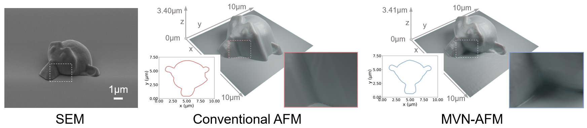
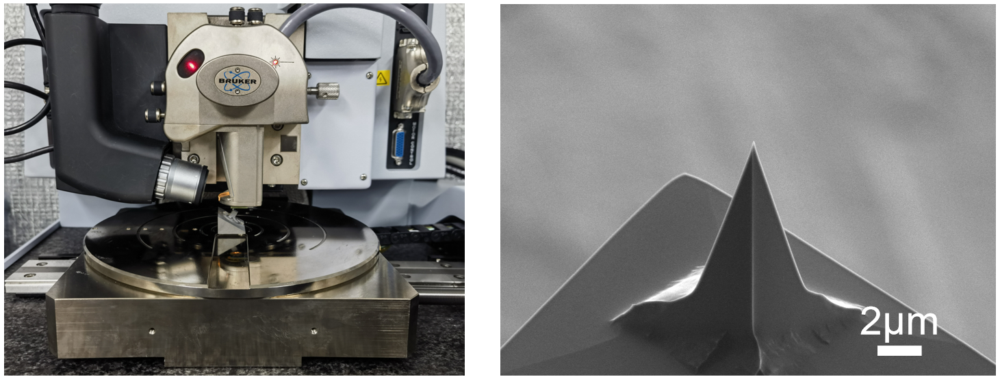
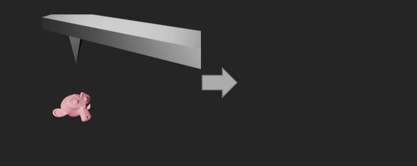
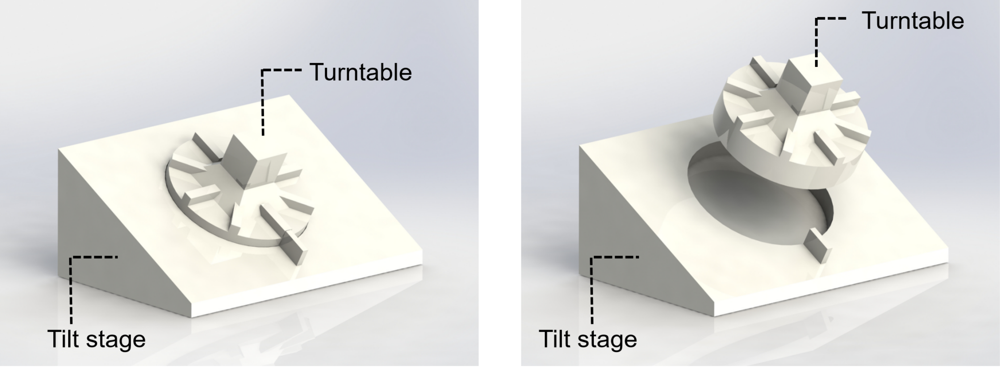

# MVN-AFM: Multi-View Neural 3D Reconstruction of Micro-/Nanostructures with Atomic Force Microscopy

## [Paper](https://arxiv.org/abs/2401.11541) | [Video]() 


**In this repository, we provide a framework that achieves 3D surface reconstruction of intricate micro-/nanostructures based on multi-view scanning results from a commercial atomic force microscopy(AFM) and a standard probe. To the best of our knowledge, this is the first time neural implicit surface reconstruction techniques have been applied to nanotechnology. We hope our method becomes a cost-effective tool for researchers to analyze 3D micro-/nanostructures.**

<p align="center">

</p>

<p align="center">
 
</p>
In our experiments, MVN-AFM successfully reconstructed 3D surface models of TPL microstructures (2~3.5 μm), PMMA nanospheres (~500 nm), and ZIF-67 nanocrystals (~300 nm).


---
## Multi-view AFM Data Scanning

We tested our method on a commercial AFM, [Bruker Icon](https://www.bruker.com/en/products-and-solutions/microscopes/materials-afm/dimension-icon-afm.html), working in tapping mode. The probe we used was the [TESPA-V2 (Bruker)](https://www.brukerafmprobes.com/p-3844-tespa-v2.aspx), which has a height of **15 μm**, an overall shape of a quadrilateral pyramid, a front angle of 25°, a back angle of 17.5°, and a side angle of 20°.
<p align="center">

</p>

These two animations briefly demonstrate the conventional AFM scanning and the multi-view AFM scanning process.
<p align="center">


</p>

This is the model of our tilt sample stage, consisting of a base with a tilt angle and a circular turntable. You can access our **.STEP** design models for both parts [here](stage_models/) and construct this stage by 3D printing. 
Since our method does not require the tilt angle as a priori information, users can redesign the sizes of the stage based on the AFM you are using.

<p align="center">

</p>

Following [this tutorial](prepare_data/README.md), we show how to convert the raw data from multi-view AFM scanning into the data format required for later program processing. 

## Code requirements
### Hardware
- A graphic card with memory larger than 12 gigabytes.

### Environment
- [PyTorch>=1.10](https://pytorch.org/get-started/locally/)
- `pip install git+https://github.com/NVlabs/tiny-cuda-nn/#subdirectory=bindings/torch`
- `pip install -r requirements.txt`
- See [here](https://github.com/bennyguo/instant-nsr-pl) for more details of software requirements.

## Running code
We have organized the commands for the entire framework into the script **run.sh**, and the 3D surface reconstruction of the sample can be automatically accomplished by simply running the following command.
```
./run.sh
```
**MVN_AFM_DIR** is the folder of MVN-AFM. **DATA_NAME** is the folder name within **load/** where multi-view AFM data for a sample is saved. **DATA_NUM** is the number of AFM multi-view scans of the sample, which defaults to 9 in our experiments, and the user can modify this value according to your collected data.
### Multi-view AFM data alignment
This program aligns the multi-view AFM data into the same coordinate. The multi-view AFM images for a sample in .npz format are placed in the **input_folder**, and the solved coordinate transformation (poses) of each view will be added to the .npz files, keeping other elements unchanged.
```
python mv_align.py --input_folder load/${DATA_NAME}/ --data_num ${DATA_NUM}
```

### Multi-view AFM data mask solving
This code cross-validates the AFM data in the **input_folder** based on current poses and AFM values saved in the .npz files. The **threshold** is set to make the algorithm robust to noises in the AFM data and inaccurate poses during the iteration. The solved AFM masks will be added to the .npz files.


```
python compute_mask.py --input_folder load/${DATA_NAME}/ --threshold ${THRESHOLD} --data_num ${DATA_NUM}
```

### Neural implicit surface reconstruction of multi-view AFM data
This program performs neural implicit surface reconstruction of the micro-/nanostructures based on the multi-view AFM data with poses and masks solved by previous steps.
After about 8 minutes of training on an RTX4090 graphics card, we extract a .obj model of the sample surface from the network.
```
python launch.py --config configs/afm.yaml --gpu ${GPU_NUM} --train dataset.scene=${DATA_NAME} tag=reconstruct trial_name=reconstruction name=${DATA_NAME} dataset.root_dir=./load/${DATA_NAME}/ 
```


## Acknowledgements
Thanks [instant-nsr-pl](https://github.com/bennyguo/instant-nsr-pl) for providing nice implementation of instant neural implicit surface reconstruction.

## Citation
If you find this code/work useful in your own research, please consider citing the following:
```
@misc{chen2024multiview,
      title={Multi-View Neural 3D Reconstruction of Micro-/Nanostructures with Atomic Force Microscopy}, 
      author={Shuo Chen and Mao Peng and Yijin Li and Bing-Feng Ju and Hujun Bao and Yuan-Liu Chen and Guofeng Zhang},
      year={2024},
      eprint={2401.11541},
      archivePrefix={arXiv},
      primaryClass={cs.CV}
}
```
